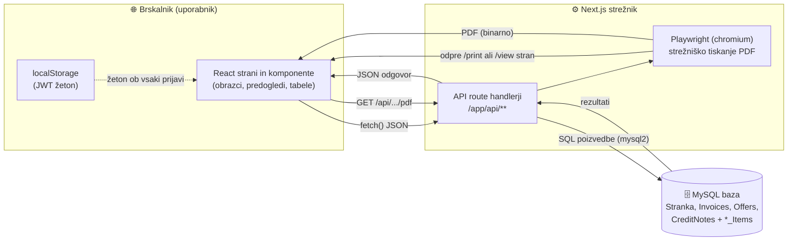
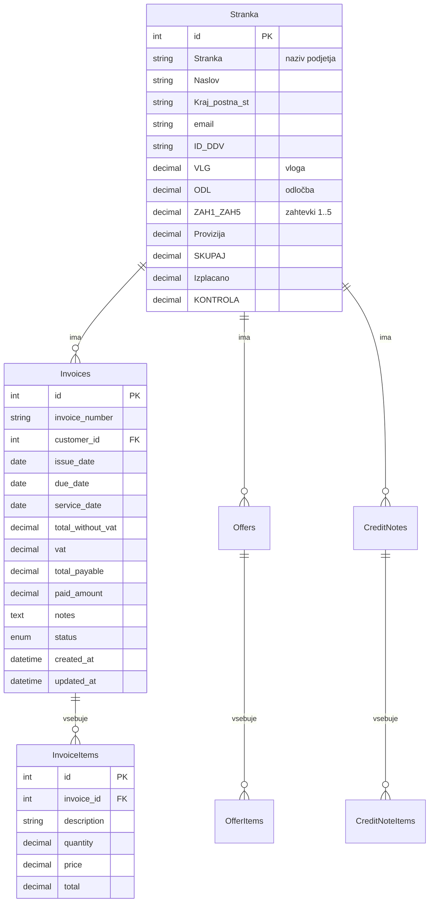
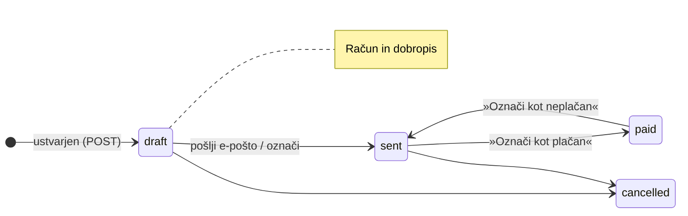
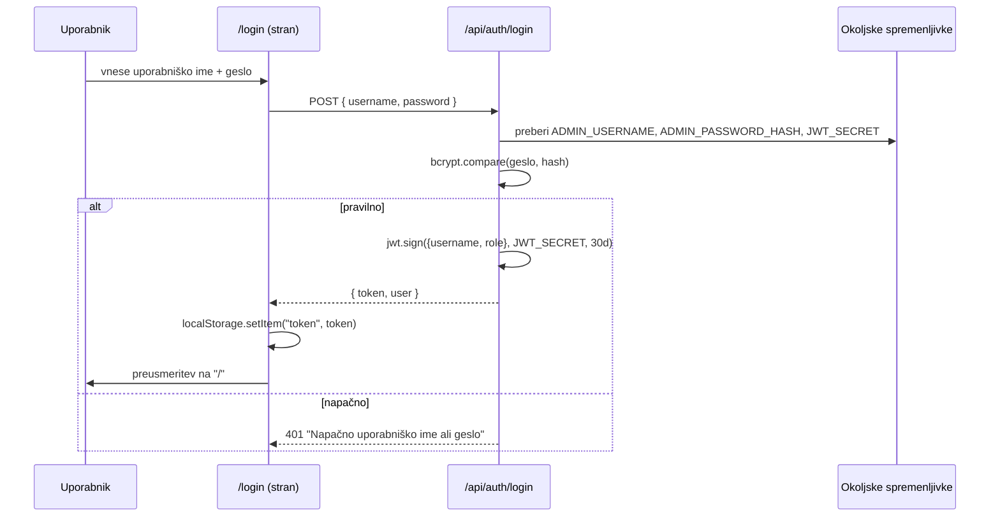
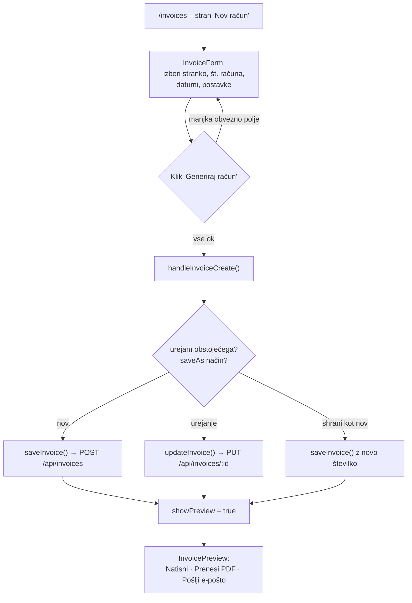
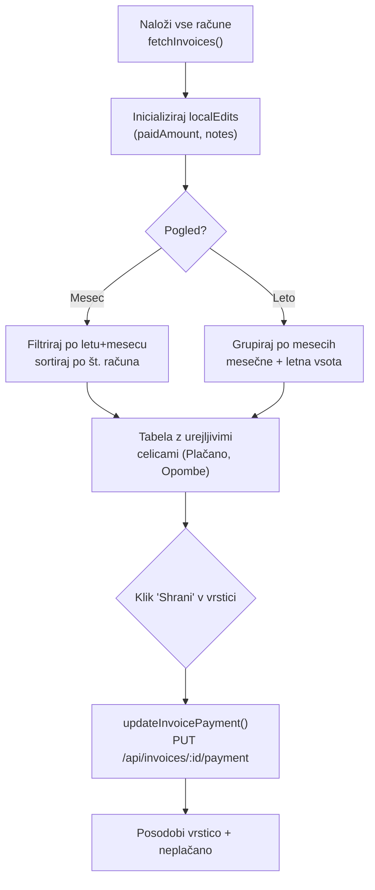
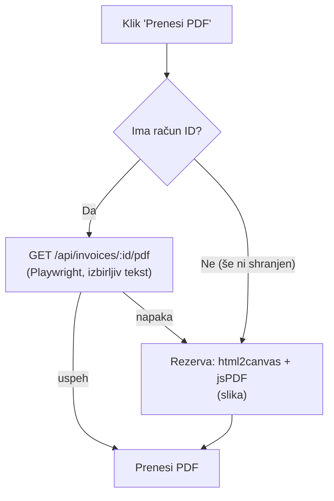
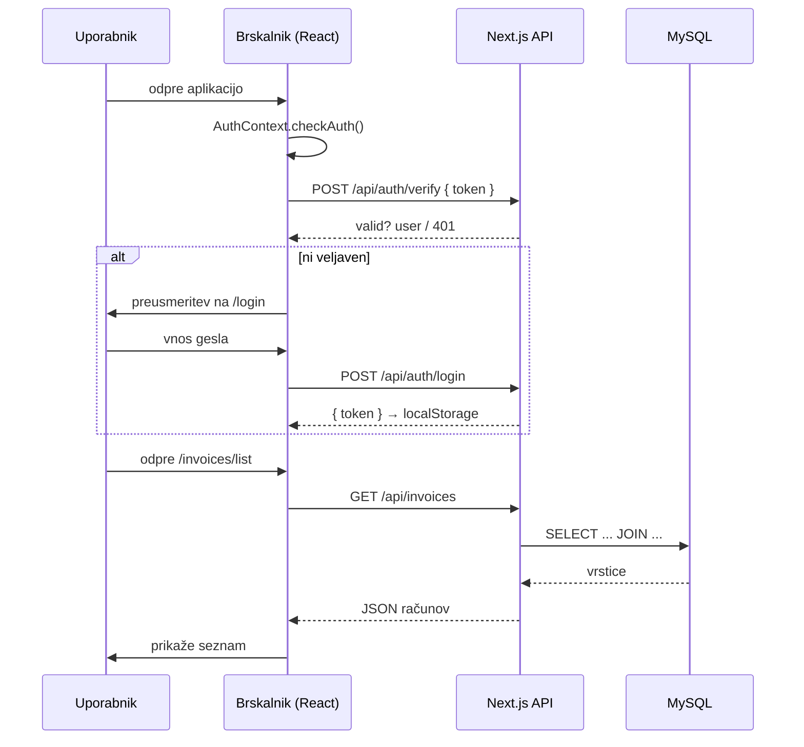
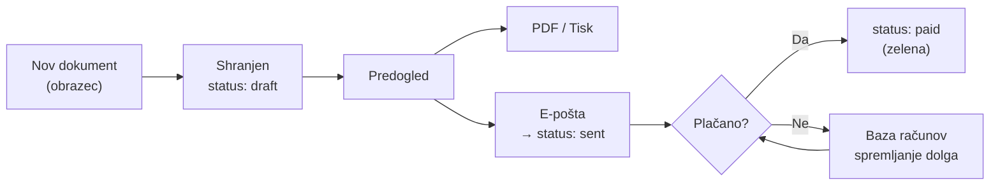
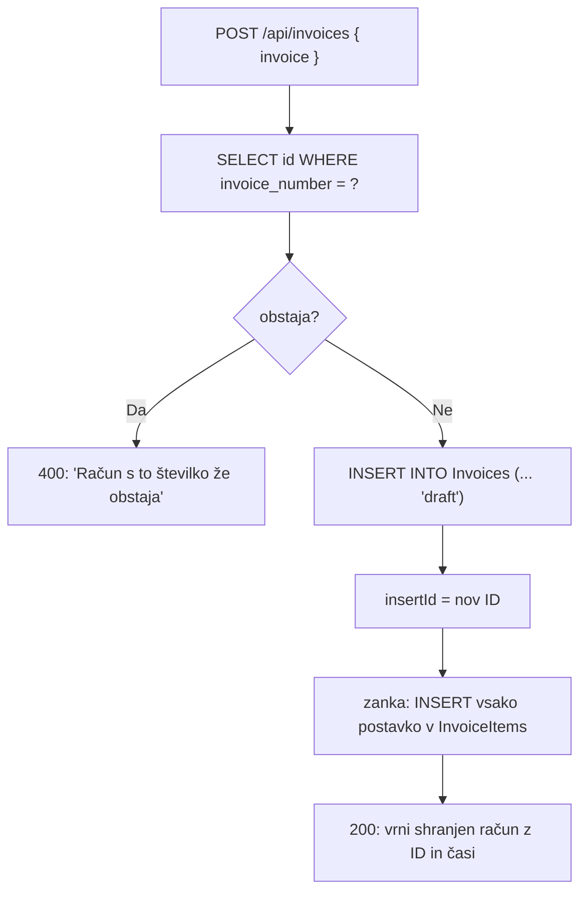

# Računko – Celovita dokumentacija aplikacije

> Sistem za upravljanje strank in izdajanje računov, ponudb ter dobropisov za podjetje **2KM Consulting d.o.o.**
>
> Avtor: Anže Kos · Različica aplikacije: v4.5

Ta dokument razlaga **vsak del aplikacije** – najprej **po domače** (kaj nekaj počne in zakaj), nato **razvojno** (kako je to narejeno v kodi). Vključeni so tudi **diagrami poteka** (Mermaid).

---

## Kazalo

1. [Kaj aplikacija sploh počne (pregled)](#1-kaj-aplikacija-sploh-počne-pregled)
2. [Tehnologije in zakaj so izbrane](#2-tehnologije-in-zakaj-so-izbrane)
3. [Arhitektura na visoki ravni](#3-arhitektura-na-visoki-ravni)
4. [Struktura map in datotek](#4-struktura-map-in-datotek)
5. [Podatkovna baza (model podatkov)](#5-podatkovna-baza-model-podatkov)
6. [Povezava z bazo – `lib/db-connection.ts`](#6-povezava-z-bazo--libdb-connectionts)
7. [Avtentikacija in prijava](#7-avtentikacija-in-prijava)
8. [Podatkovna plast `lib/database.ts`](#8-podatkovna-plast-libdatabasets)
9. [API poti (backend)](#9-api-poti-backend)
10. [Modul: Stranke](#10-modul-stranke)
11. [Modul: Računi](#11-modul-računi)
12. [Modul: Ponudbe](#12-modul-ponudbe)
13. [Modul: Dobropisi](#13-modul-dobropisi)
14. [Baza računov (knjiga plačil / ledger)](#14-baza-računov-knjiga-plačil--ledger)
15. [Generiranje PDF](#15-generiranje-pdf)
16. [Pošiljanje e-pošte](#16-pošiljanje-e-pošte)
17. [Uporabniški vmesnik (UI knjižnica)](#17-uporabniški-vmesnik-ui-knjižnica)
18. [Diagrami poteka (zbrani)](#18-diagrami-poteka-zbrani)
19. [Znane pomanjkljivosti in možne izboljšave](#19-znane-pomanjkljivosti-in-možne-izboljšave)

---

## 1. Kaj aplikacija sploh počne (pregled)

**Po domače:** Računko je spletna aplikacija, v katero se prijavi en sam uporabnik (administrator – lastnik podjetja). Po prijavi lahko:

- vodi **bazo strank** (podjetja, ki jim izdaja dokumente) z zelo podrobnimi finančnimi podatki o sofinanciranju/subvencijah,
- ustvarja **račune** (zahteva za plačilo opravljene storitve),
- ustvarja **ponudbe** (predračun – še ni zahteva za plačilo),
- ustvarja **dobropise** (vračilo/popravek že izdanega računa),
- vsak dokument **shrani v bazo**, ga **natisne**, **prenese kot PDF** ali **pošlje po e-pošti**,
- v **»Bazi računov«** spremlja, koliko je posamezna stranka že plačala in koliko še dolguje, po mesecih in letih.

Vse je v slovenščini in prilagojeno slovenski zakonodaji (DDV 22 %, sklic na TRR, zamudne obresti ipd.).

**Razvojno:** Gre za **Next.js 15 (App Router)** aplikacijo, ki združuje frontend (React 18) in backend (API route handlerji) v istem projektu. Podatki se hranijo v **MySQL** bazi, do katere backend dostopa prek knjižnice `mysql2`. Avtentikacija temelji na **JWT** žetonu, shranjenem v brskalniku. PDF se generira na dva načina (strežniško z **Playwright** ali v brskalniku z **html2canvas + jsPDF**).

---

## 2. Tehnologije in zakaj so izbrane

| Tehnologija | Vloga v aplikaciji | Po domače |
|---|---|---|
| **Next.js 15 (App Router)** | Ogrodje za frontend in backend hkrati | En sam projekt za stran in strežnik |
| **React 18 + TypeScript** | Gradnja uporabniškega vmesnika | Sestavljanje strani iz »komponent« z varnostjo tipov |
| **Tailwind CSS v4** | Oblikovanje (stilizacija) | Oblikovanje z razredi neposredno v HTML-ju |
| **shadcn/ui + Radix UI** | Gotove UI komponente (gumbi, modali, tabele …) | Knjižnica vnaprej pripravljenih gradnikov |
| **MySQL + mysql2** | Shranjevanje podatkov | »Excelova preglednica« na strežniku |
| **jsonwebtoken (JWT)** | Prijava / seja uporabnika | Digitalna »vstopnica«, da si prijavljen |
| **bcryptjs** | Varno shranjevanje gesla (hash) | Geslo ni shranjeno v berljivi obliki |
| **Playwright (chromium)** | Strežniško tiskanje strani v PDF | Strežnik »natisne« spletno stran v PDF |
| **jsPDF + html2canvas** | PDF v brskalniku (rezervna pot) | PDF se sestavi kar pri uporabniku |
| **lucide-react** | Ikone | Sličice (koš, pošlji, prenesi …) |
| **date-fns / Intl** | Delo z datumi in oblikovanje števil | Datumi in zneski v slovenskem zapisu |
| **Vercel Analytics** | Statistika obiska | Štetje obiskov |

> **Opomba o konfiguraciji (`next.config.mjs`):** med gradnjo so namenoma **izklopljene** TypeScript napake (`ignoreBuildErrors: true`) in ESLint (`ignoreDuringBuilds: true`), slike pa niso optimizirane (`unoptimized: true`). To pohitri razvoj in omogoča gradnjo kljub manjšim napakam, a je hkrati slabost (glej poglavje 19).

---

## 3. Arhitektura na visoki ravni

**Po domače:** Brskalnik prikaže strani. Ko uporabnik nekaj shrani, brskalnik pošlje sporočilo strežniku (»API«). Strežnik to zapiše v bazo in odgovori. Za PDF strežnik po potrebi sam odpre nevidni brskalnik (Playwright) in natisne stran v PDF.



Ključna lastnost: **isti strežnik streže tako spletne strani kot API in PDF**. Frontend in backend nista ločena projekta.

---

## 4. Struktura map in datotek

```
Racunko/
├── app/                         # Next.js App Router (strani + API)
│   ├── api/                     # BACKEND – vse strežniške poti
│   │   ├── auth/                #   prijava (login) in preverjanje (verify)
│   │   ├── customers/           #   CRUD za stranke
│   │   ├── invoices/            #   CRUD + status + plačilo + PDF za račune
│   │   ├── offers/              #   CRUD + status + PDF za ponudbe
│   │   ├── credit-notes/        #   CRUD + status + PDF za dobropise
│   │   ├── send-email/          #   (zaglavje za pošiljanje e-pošte)
│   │   └── test-db/             #   test povezave z bazo
│   ├── contexts/AuthContext.tsx # globalno stanje prijave (React Context)
│   ├── customers/page.tsx       # stran: stranke
│   ├── invoices/                # strani: nov račun, seznam, pogled, tisk, ledger
│   ├── offers/                  # strani: ponudbe
│   ├── credit-notes/            # strani: dobropisi
│   ├── login/page.tsx           # prijavna stran
│   ├── layout.tsx               # skupni ovoj vseh strani (Auth, fonti)
│   ├── page.tsx                 # domača (nadzorna) stran
│   └── globals.css              # globalni stili
├── components/                  # ponovno uporabljive React komponente
│   ├── invoice-form.tsx         # obrazec za račun
│   ├── invoice-preview.tsx      # predogled/izgled računa
│   ├── offer-*, credit-note-*   # enako za ponudbe in dobropise
│   ├── customer-form.tsx        # obrazec za stranko (Tabs)
│   ├── customer-table.tsx       # tabela strank
│   ├── document-form.tsx        # generičen obrazec dokumenta (alternativa)
│   ├── sidebar.tsx, header.tsx  # navigacija
│   ├── ProtectedRoute.tsx       # »straža« – preusmeritev na /login
│   └── ui/                      # shadcn/ui gradniki (gumbi, kartice, modali …)
├── lib/                         # poslovna logika in pomožne funkcije
│   ├── db-connection.ts         # bazni »pool« in funkcija query()
│   ├── database.ts              # tipi + funkcije, ki kličejo API (fetch)
│   ├── pdf-generator*.ts(x)     # generiranje PDF za račun/ponudbo/dobropis
│   ├── email-service*.ts        # priprava e-pošte za vsak dokument
│   └── utils.ts                 # cn() in parseLocaleNumber()
├── scripts/
│   ├── 01-create-database.sql   # shema tabele Stranka
│   ├── 02-seed-sample-data.sql  # vzorčni podatki
│   └── generate-hash.js         # generiranje bcrypt hasha za geslo
├── public/images/               # logotipi, podpis
└── next.config.mjs, tsconfig.json, package.json …
```

---

## 5. Podatkovna baza (model podatkov)

**Po domače:** Baza je razdeljena na tri vrste »map«:
- **Stranka** – podroben karton vsake stranke (tudi finančno sledenje subvencijam).
- **Glave dokumentov** – `Invoices`, `Offers`, `CreditNotes` (kdaj, komu, koliko skupaj).
- **Postavke dokumentov** – `InvoiceItems`, `OfferItems`, `CreditNoteItems` (posamezne vrstice: opis, količina, cena).

Vsak dokument ima eno glavo in več postavk, vsak dokument pa kaže na eno stranko.



### 5.1 Tabela `Stranka` (najbolj posebna)

Definirana je v `scripts/01-create-database.sql`. Vsebuje **več kot 60 stolpcev**, ker služi specifični panogi: **svetovanje pri pridobivanju nepovratnih sredstev / subvencij** (javni razpisi). Pomen okrajšav:

- **VLG** = vloga (vrednost prijave/vloge), `VLG_z_DDV` = z 22 % DDV.
- **ODL** = odločba (odobreni znesek), `ODL_z_DDV`, `ODL_izplacano`.
- **ZAH1 … ZAH5** = zahtevki za izplačilo (do 5 obrokov), vsak s svojim `_z_DDV`, `_izplacano` in `Delež_*`.
- **Gotovina_1 … Gotovina_7**, **Status_1 … Status_8**, **Racun_izdal_1 … _7** = sledenje stanja po posameznih korakih.
- **Provizija** = dogovorjeni odstotek/znesek za svetovalca.
- **SKUPAJ** = vsota ODL + ZAH1..ZAH5.
- **Izplacano** = vsota vseh izplačanih zahtevkov.
- **KONTROLA** = `VLG + Izplacano × Provizija` (kontrolni izračun).

> **Pomembno:** Tabele `Invoices`, `Offers`, `CreditNotes` in pripadajoče `*Items` v SQL skriptah niso priložene (skripta ustvari le `Stranka`). Iz poizvedb v API-jih natančno vidimo njihovo strukturo (stolpce), a sheme za njihovo kreiranje v repozitoriju ni – v produkciji so bile ustvarjene ločeno. To je vredno omeniti pri zagovoru (glej poglavje 19).

### 5.2 Statusi dokumentov (enum)

| Dokument | Možni statusi | Pomen |
|---|---|---|
| Račun | `draft`, `sent`, `paid`, `cancelled` | osnutek, poslan, plačan, preklican |
| Ponudba | `draft`, `sent`, `accepted`, `rejected` | osnutek, poslana, sprejeta, zavrnjena |
| Dobropis | `draft`, `sent`, `paid`, `cancelled` | osnutek, poslan, izplačan, preklican |



---

## 6. Povezava z bazo – `lib/db-connection.ts`

**Po domače:** Da se aplikaciji ni treba vsakič na novo povezovati z bazo (kar je počasno), si ustvari »bazenček« (pool) že odprtih povezav in jih ponovno uporablja. Vsaka poizvedba si izposodi povezavo, jo uporabi in vrne.

**Razvojno – ključni deli:**

```ts
let pool: mysql.Pool | null = null            // en sam pool za vse zahteve

function getPool() {
  if (!pool) {
    const isServerless = !!process.env.VERCEL || ...   // manj povezav v serverless okolju
    pool = mysql.createPool({
      host: process.env.DB_HOST, user: ..., password: ..., database: ...,
      connectionLimit, connectTimeout,
      enableKeepAlive: true, keepAliveInitialDelay: 10000,
    })
  }
  return pool
}

export async function query(sql, params) {
  const connection = await getPool().getConnection()
  try {
    const [results] = await connection.execute({ sql, values: params ?? [], timeout })
    return results
  } catch (e) { console.error(...); throw e }
  finally {
    if (elapsedMs >= slowQueryWarnMs) console.warn(`Slow DB query ...`)  // opozorilo na počasne poizvedbe
    connection.release()                                                 // vedno vrni povezavo
  }
}
```

Ključne lastnosti:
- **Parametrizirane poizvedbe** (`?` + `values`) → zaščita pred SQL injection.
- **Konfiguracija prek okoljskih spremenljivk** (`DB_HOST`, `DB_USER`, `DB_PASSWORD`, `DB_NAME`, `DB_PORT`).
- **Prilagodljive omejitve** prek spremenljivk (`DB_CONNECTION_LIMIT`, `DB_QUERY_TIMEOUT_MS` …) s smiselnimi privzetki.
- **Beleženje počasnih poizvedb** (privzeto > 1500 ms).
- `getConnection()` se uporablja, kadar potrebujemo surovo povezavo (npr. v `test-db`).

---

## 7. Avtentikacija in prijava

**Po domače:** Aplikacija ima **enega samega uporabnika** (administratorja). Uporabniško ime in (zašifrirano) geslo sta shranjena v okoljskih spremenljivkah strežnika, ne v bazi. Ob prijavi strežnik preveri geslo in izda »vstopnico« (JWT žeton) z veljavnostjo 30 dni. Žeton se shrani v brskalnik. Ob vsakem odpiranju strani aplikacija žeton pošlje strežniku v preverjanje.

### 7.1 Prijava – `app/api/auth/login/route.ts`



Bistvo kode:
- Iz `process.env` prebere `ADMIN_USERNAME`, `ADMIN_PASSWORD_HASH`, `JWT_SECRET`. Če katera manjka → napaka 500.
- Preveri uporabniško ime (enostavna primerjava) in geslo z `bcrypt.compare`.
- Ob uspehu: `jwt.sign({ username, role: "admin", timestamp }, jwtSecret, { expiresIn: "30d" })`.
- Hash gesla se ustvari ročno s `scripts/generate-hash.js` (`bcrypt.hashSync(password, 10)`).

### 7.2 Preverjanje žetona – `app/api/auth/verify/route.ts`

POST sprejme `{ token }`, ga preveri s `jwt.verify(token, JWT_SECRET)`. Če je veljaven → `{ valid: true, user }`, sicer 401. (Vsebuje obsežno `console.log` beleženje za razhroščevanje.)

### 7.3 Globalno stanje prijave – `app/contexts/AuthContext.tsx`

React **Context**, ki ga `layout.tsx` ovije okrog cele aplikacije. Hrani `user` in `loading`. Funkcija `checkAuth()`:
1. Iz `localStorage` prebere žeton.
2. Če ga ni → preusmeri na `/login`.
3. Sicer pokliče `/api/auth/verify`. Če je veljaven → nastavi `user`; sicer pobriše žeton in preusmeri na prijavo.
4. Sproži se ob vsaki menjavi poti (`pathname`).

Ponuja še `login(token, user)` (shrani žeton + preusmeri na `/`) in `logout()` (pobriše žeton + preusmeri na `/login`).

### 7.4 Straža poti – `components/ProtectedRoute.tsx`

Komponenta, ki ovije zaščitene strani. Dokler traja preverjanje, kaže vrtavko (»Preverjanje avtentikacije…«). Če uporabnika ni, izriše `null` in preusmeri na `/login`.

> **Pomembno (varnost):** zaščita je **samo na strani brskalnika**. API poti (`/api/invoices` …) **ne preverjajo** žetona, zato so tehnično dosegljive brez prijave. Glej poglavje 19.

---

## 8. Podatkovna plast `lib/database.ts`

**Po domače:** To je »telefonski imenik« funkcij, ki jih kličejo strani v brskalniku, da pridobijo ali shranijo podatke. Vsaka funkcija pošlje zahtevo na ustrezno API pot in vrne rezultat.

**Razvojno:** Datoteka vsebuje:

1. **TypeScript tipe/vmesnike**: `Customer` (zrcalo tabele Stranka), `InvoiceItem`, `Invoice`, `SavedInvoice` (= Invoice + status + časi), enako `Offer`/`SavedOffer`, `CreditNote`/`SavedCreditNote`.
2. **Funkcije za klic API** (vse uporabljajo `fetch`):
   - Stranke: `fetchCustomers`, `createCustomer`, `updateCustomer`.
   - Računi: `saveInvoice`, `fetchInvoices`, `fetchInvoiceById`, `updateInvoice`, `deleteInvoice`, `updateInvoiceStatus`, `updateInvoicePayment`.
   - Ponudbe in dobropisi: ekvivalentne funkcije (`saveOffer`, `fetchOffers`, … `saveCreditNote`, …).

Primer (vzorec, ki se ponavlja):

```ts
export async function saveInvoice(invoice: Invoice): Promise<SavedInvoice> {
  const response = await fetch('/api/invoices', {
    method: 'POST',
    headers: { 'Content-Type': 'application/json' },
    body: JSON.stringify(invoice),
  })
  if (!response.ok) {
    const error = await response.json()
    throw new Error(error.error || 'Napaka pri shranjevanju računa')
  }
  return response.json()
}
```

Ta plast loči **»kako prikazati«** (komponente) od **»kako dobiti podatke«** (te funkcije). To je dobra praksa, ker če bi se API spremenil, popravimo le to datoteko.

---

## 9. API poti (backend)

Vsaka mapa pod `app/api/` z datoteko `route.ts` postane strežniška pot. Funkcije `GET`, `POST`, `PUT`, `DELETE` ustrezajo HTTP metodam.

### 9.1 Vzorec za dokumente (računi/ponudbe/dobropisi)

Vsi trije moduli imajo **enak vzorec**:

| Pot | Metoda | Kaj počne |
|---|---|---|
| `/api/invoices` | `GET` | vrne **vse** račune (en JOIN čez glave + postavke + stranko) |
| `/api/invoices` | `POST` | ustvari nov račun (+ postavke), status `draft` |
| `/api/invoices/[id]` | `GET` | vrne en račun s postavkami |
| `/api/invoices/[id]` | `PUT` | posodobi račun (zbriše stare postavke, vstavi nove) |
| `/api/invoices/[id]` | `DELETE` | izbriše račun |
| `/api/invoices/[id]/status` | `PUT` | spremeni status (z validacijo) |
| `/api/invoices/[id]/payment` | `PUT` | zapiše plačani znesek + opombo |
| `/api/invoices/[id]/pdf` | `GET` | strežniško zgenerira PDF (Playwright) |

#### GET vseh računov – optimizacija proti »N+1«

**Po domače:** Namesto da bi za vsak račun posebej spraševali bazo po njegovih postavkah (kar je počasno), se vse pridobi z **eno samo poizvedbo** z `JOIN`, nato pa se rezultati v kodi razvrstijo v pravilno strukturo.

```ts
const result = await query(`
  SELECT i.*, s.Stranka, s.Naslov, ..., 
         ii.id as item_id, ii.description as item_description, ...
  FROM Invoices i
  LEFT JOIN Stranka s ON i.customer_id = s.id
  LEFT JOIN InvoiceItems ii ON i.id = ii.invoice_id
  ORDER BY i.created_at DESC, ii.id ASC
`)

const invoicesMap = new Map()
result.forEach(row => {
  if (!invoicesMap.has(row.id)) {
    invoicesMap.set(row.id, { /* glava računa + prazen items: [] */ })
  }
  if (row.item_id) {
    invoicesMap.get(row.id).items.push({ /* postavka */ })
  }
})
return NextResponse.json(Array.from(invoicesMap.values()))
```

Komentar `// ✅ EN SAM QUERY z JOIN namesto N+1` v kodi to izrecno poudarja.

#### POST (ustvarjanje) – preverjanje podvojene številke

```ts
const existing = await query('SELECT id FROM Invoices WHERE invoice_number = ?', [invoice.invoiceNumber])
if (existing.length > 0) return NextResponse.json({ error: 'Račun s to številko že obstaja' }, { status: 400 })

const result = await query(`INSERT INTO Invoices (...) VALUES (?, ?, ..., 'draft')`, [...])
const invoiceId = result.insertId
for (const item of invoice.items) {
  await query(`INSERT INTO InvoiceItems (...) VALUES (?, ?, ?, ?, ?)`, [invoiceId, ...])
}
```

#### PUT (urejanje) – »izbriši in vstavi« postavke

Pri urejanju se glava posodobi z `UPDATE`, postavke pa se **vse zbrišejo** (`DELETE FROM InvoiceItems WHERE invoice_id = ?`) in **na novo vstavijo**. To je preprosto in zanesljivo (ni treba ugotavljati, katera postavka je nova/spremenjena/izbrisana).

### 9.2 Razlike med moduli (povzetek)

- **Status validacija** se razlikuje: računi/dobropisi `['draft','sent','paid','cancelled']`, ponudbe `['draft','sent','accepted','rejected']`.
- **Plačila** (`/payment`) ima **samo račun** (ponudbe in dobropisi jih nimajo).
- Pri **brisanju ponudbe** se najprej izbrišejo `OfferItems`, nato `Offers` (eksplicitno); pri računu/dobropisu se zanaša na (predvideno) kaskadno brisanje.

### 9.3 Pomožne API poti

- **`/api/test-db` (GET):** poskusi `SELECT 1 + 1` in vrne, ali je baza dosegljiva; ob napaki pove, katere okoljske spremenljivke obstajajo. Uporabno za diagnostiko.
- **`/api/send-email` (POST):** trenutno **simulacija** – počaka 1 s in vrne uspeh; v komentarju so navedene možnosti za pravo integracijo (Resend, SendGrid, Nodemailer, AWS SES).

---

## 10. Modul: Stranke

### 10.1 Stran `app/customers/page.tsx`

**Po domače:** Najbogatejša stran v aplikaciji. Zgoraj je obrazec za vnos/urejanje stranke, razdeljen na zavihke (Osnovni podatki, Pogodba, VLG & Provizija, Odločba, Zahtevki, Povzetek). Spodaj je tabela vseh strank z iskanjem, filtri in razvrščanjem. Posebnost: v finančna polja lahko vpišeš **formulo** (npr. `vlg * 0.8`) in se samodejno izračuna.

**Razvojno – ključne značilnosti:**

- **Demo način:** če `/api/customers` ne deluje, se naloži vgrajeni `mockData` in pokaže opozorilo »Deluje v demo načinu«. Aplikacija torej deluje tudi brez baze.
- **Računanje na strani brskalnika – `updateCalculations()`:**
  - vsako osnovno polje (VLG, ODL, ZAH1..5) pomnoži z 1,22 → `*_z_DDV`,
  - `SKUPAJ = ODL + ZAH1..5`,
  - `Izplacano = vsota *_izplacano`,
  - `KONTROLA = VLG + Izplacano × Provizija`.
- **Formule v poljih – `calculateFormula()`:** uporabnik vpiše izraz z imeni polj; koda imena nadomesti z vrednostmi in izraz **ovrednoti z `eval()`**. Pred tem je vhod omejen z regularnim izrazom `/^[0-9+\-*/(). ]+$/` (dovoljene samo številke in osnovni operatorji). *To je hkrati priročno in tvegano – glej poglavje 19.*
- **Samodokončanje (autocomplete):** za naziv stranke (predlogi obstoječih) in za imena polj znotraj formul (s tipkami ↑/↓/Enter/Esc).
- **Iskanje z zamikom (debounce 300 ms)**, filtri (status, znesek od/do, »samo z emailom«, »samo s pogodbo«) in razvrščanje po stolpcih (`localeCompare` po slovenščini).

> Opomba: stran ima vgrajen lasten vmesnik `Customer` (podvojen tip), enako velja za `customer-form.tsx` in `document-form.tsx`. Tip `Customer` torej obstaja na več mestih.

### 10.2 Komponenti `customer-form.tsx` in `customer-table.tsx`

- **`customer-form.tsx`** – alternativni obrazec za stranko s 4 zavihki (Osnovni podatki / Finančni / Izračuni / Opombe). `calculateDerivedValues()` v `useEffect` samodejno preračuna `_z_DDV`, `SKUPAJ`, `Izplacano`, `KONTROLA` ob vsaki spremembi. Polja `_z_DDV`, `SKUPAJ`, `Izplacano`, `KONTROLA` so `readOnly`.
- **`customer-table.tsx`** – tabela z iskanjem, **prikazom/skrivanjem stolpcev** (privzeto skritih veliko stolpcev za preglednost), straničenjem (10 na stran) in oblikovanjem zneskov (`€xx.xx`).

### 10.3 API `app/api/customers/route.ts` in `[id]/route.ts`

- `GET /api/customers` → `SELECT * FROM Stranka ORDER BY id DESC`.
- `POST /api/customers` → `INSERT` osnovnih polj (ostala se izračunajo), vrne novo stranko.
- `GET/PUT/DELETE /api/customers/[id]` → branje/posodobitev/brisanje ene stranke. Vse poizvedbe so parametrizirane.

---

## 11. Modul: Računi

### 11.1 Potek ustvarjanja računa



### 11.2 Obrazec `components/invoice-form.tsx`

**Po domače:** Levo izbereš podjetje (z iskanjem med strankami), desno vneseš številko in datume. Spodaj dodajaš postavke; vsaka ima opis, količino in ceno, »Skupaj« se sproti izračuna. Na dnu se prikažeta DDV (22 %) in znesek za plačilo.

**Razvojno – pomembni detajli:**
- **`CustomerAutocomplete`** (izvožena podkomponenta): filtrira stranke po nazivu in ponuja predloge.
- **Valuta (rok plačila):** ob spremembi datuma izdaje se `dueDate` samodejno nastavi na **+15 dni** (komentar v kodi: spremenjeno s 30 na 15).
- **Decimalna ločila:** polji količina in cena sta tipa `text` z `inputMode="decimal"`. Vnos se hrani kot »surov« (`rawValues`), ob izgubi fokusa pa se normalizira s `parseLocaleNumber()` (zamenja vejico s piko). Tako uporabnik lahko piše `1,5` ali `1.5`.
- **Izračun:** `totalWithoutVat = Σ(quantity × price)`, `vat = total × 0.22`, `totalPayable = total + vat`.
- **Validacija:** pred oddajo preveri, da so izbrana stranka, številka in vsi opisi postavk.
- **Načina »uredi« in »shrani kot nov« (Save As):** isti obrazec se uporabi za nov račun, urejanje (`editingInvoice`) in kopiranje (`saveAsMode` – počisti številko, da vneseš novo).

### 11.3 Predogled `components/invoice-preview.tsx`

To je **vizualna predloga računa** (točen izgled dokumenta). Vsebuje:
- logotip 2KM zgoraj desno, podatke stranke levo in podjetja desno,
- številko računa, opis storitve, **tabelo postavk** ter vrstice »Skupaj brez DDV / DDV (22 %) / Skupaj za plačilo«,
- plačilne podatke (TRR, sklic = številka računa, opozorilo o zamudnih obrestih),
- podpis (slika) in nogo s podatki podjetja,
- gumbe **Natisni / Prenesi PDF / Pošlji po e-pošti** (skriti pri tisku z razredom `print:hidden`),
- obsežne **`@media print` CSS** prilagoditve velikosti pisave za lep izpis na A4.

Zneski so oblikovani z `toLocaleString('de-DE', …)` → ločilo tisočic in dve decimalki (npr. `1.234,56`).

### 11.4 Strani računov

- **`/invoices` (page.tsx):** glavna stran (obrazec ↔ predogled), bere `?edit=` in `?saveAs=` iz URL-ja.
- **`/invoices/list`:** seznam vseh računov s statistiko (vsi / osnutki / plačani / izbrani), iskanjem, **množičnim prenosom PDF**, in akcijami na vsakem računu (Poglej, Uredi, PDF, E-pošta, Označi plačan/neplačan, Izbriši). Barva kartice se prilagaja statusu.
- **`/invoices/view/[id]`:** podroben pregled enega računa z gumbi (Označi plačan, Shrani kot nov, Uredi) in predogledom.
- **`/invoices/print/[id]`:** »čista« stran samo z dokumentom (brez navigacije) – uporablja jo strežniški PDF generator.
- **`/invoices/ledger`:** Baza računov – glej poglavje 14.

### 11.5 Množični prenos PDF (list stran)

**Po domače:** Obkljukaš več računov in klikneš »Prenesi N računov«. Aplikacija jih obdela enega za drugim: za vsakega na hitro pokaže (nevidno) predogled, ga pretvori v PDF in prenese.

**Razvojno:** v zanki nastavlja `pdfInvoice`, počaka (`setTimeout` ~1 s), da se skriti `InvoicePreview` izriše v DOM, nato pokliče `generateInvoicePDFFromElement()` in sproži prenos. Skrita komponenta je postavljena izven zaslona (`left: -10000px`).

---

## 12. Modul: Ponudbe

Ponudbe so **strukturno kopija računov**, z naslednjimi razlikami:

| Lastnost | Ponudba | Račun |
|---|---|---|
| Statusi | `draft`, `sent`, **`accepted`**, **`rejected`** | `draft`, `sent`, `paid`, `cancelled` |
| Plačilna polja | **nima** (`paidAmount`, `notes`) | ima |
| Privzeta valuta | **+30 dni** | +15 dni |
| Besedilo dokumenta | »Po opravljeni storitvi bo izdan račun« | zahteva plačila + zamudne obresti |
| Akcije | **Sprejmi / Zavrni** | Označi plačan/neplačan |
| Tabele v bazi | `Offers`, `OfferItems` | `Invoices`, `InvoiceItems` |

Datoteke: `app/offers/*`, `components/offer-form.tsx`, `components/offer-preview.tsx`, `lib/email-service-offer.ts`, `lib/pdf-generator-offer.ts`, `app/api/offers/**`. Logika (obrazec, predogled, seznam, PDF) je sicer enaka kot pri računih. E-pošta ob odpiranju samodejno označi osnutek kot »poslan«. Ponudba ima tudi **Save As** (kopiranje z novo številko).

> Opomba: avtomatske **pretvorbe ponudbe v račun** (z enim klikom) aplikacija nima – to je naravna ideja za nadgradnjo.

---

## 13. Modul: Dobropisi

Dobropis = popravek/vračilo že izdanega računa. Tudi ta modul je **kopija računov**, glavne razlike so **v besedilu** (semantika »vračila« namesto »plačila«):

| Mesto | Dobropis | Račun |
|---|---|---|
| Naslov dokumenta | »Dobropis: …« | »Račun: …« |
| Opis | »Razlog za dobropis« | »Opis storitve« |
| Vsota | »Skupaj za **vračilo**« | »Skupaj za plačilo« |
| Plačilni podatki | »Znesek **vračila** na TRR«, »Pri vračilu se sklicujte na št. dobropisa« | »Znesek nakažite …«, sklic na št. računa |
| Rok | »Vračilo bo izvedeno v roku 14 dni« | »Zamudne obresti« |
| E-pošta | govori o vračilu (14 dni) | govori o plačilu |

**Statusi so enaki kot pri računih** (`draft/sent/paid/cancelled`), zneski so **pozitivni** (ni negativnih vrednosti; razlika je le pomenska). Datoteke: `app/credit-notes/*`, `components/credit-note-*.tsx`, `lib/email-service-credit-note.ts`, `lib/pdf-generator-credit-note.ts`, `app/api/credit-notes/**`.

---

## 14. Baza računov (knjiga plačil / ledger)

Datoteka: `app/invoices/ledger/page.tsx`. To je **najbolj koristna analitična stran**.

**Po domače:** Tabela vseh računov, razdeljena po mesecih (ali za celo leto). Pri vsakem računu lahko **kar v tabeli** vpišeš, koliko je stranka plačala, in dodaš opombo. Aplikacija sproti pokaže, koliko je še neplačanega (rdeče) oz. da je v celoti plačano (zelena kljukica ✓). Spodaj so vsote: skupaj, DDV, plačano, neplačano.

**Razvojno – ključne značilnosti:**
- **Dva pogleda:** `month` (mesec) in `year` (celo leto, razdeljeno po mesecih z mesečnimi vmesnimi vsotami in velikim »LETNI SKUPAJ«).
- **Razvrščanje po številki računa:** `parseInvoiceNumber()` izlušči številke iz oznake (npr. iz `RAC-2024-001` dobi `2024001`) in po njih sortira.
- **`EditableCell`:** komponenta, ki ob kliku spremeni besedilo v vnosno polje (urejanje na mestu); shrani ob `Enter`/izgubi fokusa, prekliče ob `Escape`.
- **Lokalne spremembe (`localEdits`):** vneseni zneski/opombe se najprej hranijo lokalno; gumb »Shrani« pokliče `updateInvoicePayment()` (`PUT /api/invoices/:id/payment`).
- **Slovensko razčlenjevanje zneskov – `parseAmount()`:** razume `1.234,56` (tisočice s piko, decimalke z vejico) in `1234.56`.
- **Vsote – `calcTotals()`:** sešteje osnovo, DDV, znesek, plačano in neplačano (neplačano = `max(0, znesek − plačano)`).
- **Barvanje vrstic:** zelena = plačano, rumena = delno plačano, bela = neplačano.



---

## 15. Generiranje PDF

Aplikacija PDF ustvari na **dva načina**, z avtomatskim preklopom (fallback).

### 15.1 Strežniško (prednostno) – Playwright

Datoteke: `app/api/invoices/[id]/pdf/route.ts` (in enako za ponudbe/dobropise).

**Po domače:** Strežnik zažene pravi (a neviden) brskalnik Chromium, vanj naloži »čisto« stran z dokumentom (`/invoices/print/[id]`), počaka, da se naložijo pisave in slike, in nato stran »natisne« v PDF. Rezultat ima **oster, izbirljiv tekst** (ne sliko).

**Razvojno:**
```ts
export const runtime = "nodejs"          // potrebno za Playwright
export const dynamic = "force-dynamic"

const browser = await chromium.launch()
const page = await browser.newPage()
await page.goto(targetUrl, { waitUntil: "networkidle" })
await page.waitForSelector("#invoice-preview-content", { state: "visible", timeout: 30000 })
await page.emulateMedia({ media: "print" })   // uporabi @media print CSS
await page.evaluate(/* počakaj document.fonts.ready in vse slike */)
const pdf = await page.pdf({ format: "A4", printBackground: true, preferCSSPageSize: true,
                            margin: { top:"10mm", right:"10mm", bottom:"10mm", left:"10mm" } })
// ime datoteke = "<št. računa> <stranka>.pdf" (počiščeno nedovoljenih znakov)
```

### 15.2 V brskalniku (rezervno) – html2canvas + jsPDF

Datoteka: `lib/pdf-generator.tsx`, funkcija `generateInvoicePDFFromElement()`.

**Po domače:** Vzame element predogleda, ga prerisuje v sliko visoke ločljivosti (kot fotografijo) in to sliko vstavi v PDF. Tekst je v tem primeru **slika** (ostro, a ne izbirljivo).

**Razvojno – pomembni koraki:**
- Skrije gumbe (`.print:hidden`) in klonira element v skrit `div` širine `210mm` (A4).
- **Normalizacija barv `oklch → hex`:** html2canvas ne razume sodobnega zapisa barv `oklch()`, zato jih `convertOklchToHex()`/`normalizeColors()` pretvorita v `#rrggbb`. *To je pogost vir težav pri PDF in dober primer za zagovor.*
- `html2canvas(..., { scale: 3.0 })` → ~300 DPI (tiskarska kakovost).
- `jsPDF({ format: 'a4', compress: true })`, slika se po potrebi pomanjša, da gre na eno stran.
- `addFooterToPDF()` doda **vektorsko nogo** (oster tekst s podatki podjetja in TRR), ki se ne riše kot slika.

### 15.3 Izbira poti – `downloadInvoicePDFFromPreview()`



Če dokument že ima ID (je shranjen), se poskusi strežniška pot; ob napaki se samodejno uporabi pot v brskalniku. Če ID-ja ni, gre takoj po poti v brskalniku.

---

## 16. Pošiljanje e-pošte

Datoteke: `lib/email-service.ts` (+ `-offer`, `-credit-note`) in `app/api/send-email/route.ts`.

**Po domače:** Klik na »Pošlji po e-pošti« **odpre uporabnikov e-poštni program** (Outlook, Gmail …) z že pripravljenim prejemnikom, zadevo in besedilom (`mailto:` povezava). Pravega samodejnega pošiljanja s priponko strežnik (še) ne izvaja.

**Razvojno:**
- `openEmailClient(invoice)`:
  1. če je dokument v statusu `draft`, ga prek `/status` API-ja označi kot `sent`,
  2. sestavi zadevo in telo (številka, datumi, znesek, TRR, sklic),
  3. odpre `mailto:` povezavo z `window.open(...)`.
- `app/api/send-email/route.ts` je **zaglavje (stub)** – le simulira pošiljanje (1 s zakasnitve, vrne uspeh). V komentarju so predlogi za pravo storitev (Resend, SendGrid, Nodemailer, AWS SES).

> V `lib/email-service.ts` obstaja tudi starejša funkcija `sendInvoiceEmail`, ki vsebuje napako (sklicuje se na nedefinirana `subject`/`body`); dejansko se uporablja `openEmailClient`. Vredno omeniti pri pregledu kode.

---

## 17. Uporabniški vmesnik (UI knjižnica)

**Po domače:** Da gumbi, okvirji, modalna okna in tabele povsod izgledajo enako, aplikacija uporablja knjižnico vnaprej pripravljenih gradnikov.

**Razvojno:**
- **`components/ui/`** vsebuje **shadcn/ui** komponente (zgrajene na **Radix UI** primitivih): `button`, `card`, `input`, `select`, `dialog`, `tabs`, `dropdown-menu`, `table`, `badge`, `alert`, `toast`/`sonner`, `calendar` itd.
- **`lib/utils.ts → cn()`** združuje razrede Tailwind (`clsx` + `tailwind-merge`), da se nasprotujoči si razredi pravilno prepišejo.
- **Navigacija:** `components/sidebar.tsx` (zložljiv stranski meni z vsemi povezavami) in `components/header.tsx` (zgornja vrstica z iskalnikom in ikonami).
- **`components/theme-provider.tsx`** (next-themes) za temo.
- **`hooks/use-toast.ts`, `hooks/use-mobile.ts`** – obvestila (toast) in zaznava mobilne širine.
- **`app/layout.tsx`** naloži pisavo **Geist**, nastavi `lang="sl"`, metapodatke in ovije vse v `AuthProvider`.

---

## 18. Diagrami poteka (zbrani)

### 18.1 Splošni potek seje uporabnika



### 18.2 Življenjski cikel dokumenta (od osnutka do plačila)



### 18.3 Obdelava POST zahteve za nov račun (strežnik)



---

## 19. Znane pomanjkljivosti in možne izboljšave

Za zagovor je dobro poznati tudi **šibke točke** (in kako bi jih popravili):

**Varnost**
1. **API poti niso zaščitene na strežniku** – preverjanje prijave je le v brskalniku (`ProtectedRoute`). Rešitev: Next.js **middleware** ali preverjanje JWT v vsakem `route.ts`.
2. **JWT v `localStorage`** je dovzeten za XSS. Bolje: `httpOnly` piškotek.
3. **`eval()` pri formulah strank** (čeprav omejen z regexom) je potencialno tvegan. Bolje: varen razčlenjevalnik izrazov (npr. mathjs).
4. **Eden, fiksen uporabnik** prek okoljskih spremenljivk – ni vlog ali več uporabnikov.

**Podatkovni model**
5. V repozitoriju **manjkajo SQL skripte** za tabele `Invoices/Offers/CreditNotes` in `*Items` (obstaja le `Stranka`). Strukturo poznamo le iz poizvedb.
6. **Podvojeni tipi `Customer`** (v `lib/database.ts`, `app/customers/page.tsx`, `document-form.tsx`).

**Kakovost in robustnost**
7. **Izklopljene TypeScript/ESLint napake** med gradnjo – lahko skrijejo prave napake.
8. **E-pošta ni zares poslana** (samo `mailto:`); `/api/send-email` je le simulacija.
9. **Računanje z `number` (float)** lahko povzroči zaokroževalne napake pri zneskih; za finance je bolje delati s celimi števili (centi) ali decimalnim tipom.
10. **Mrtva/napačna koda:** `sendInvoiceEmail` z nedefiniranima `subject`/`body`.
11. **Množični PDF** se generira zaporedno z `setTimeout` – počasno pri veliko dokumentih.

**Funkcionalne nadgradnje**
12. **Pretvorba ponudbe → račun** z enim klikom.
13. **Samodejno številčenje** dokumentov (zaporedne številke na leto).
14. **Izvoz v e-SLOG / UBL** (elektronski računi za javni sektor).
15. **Dashboard z grafi** (recharts je že v odvisnostih).

---

*Konec dokumentacije. Za strukturo diplomskega dela glej `02-diplomsko-porocilo.md`, za vprašanja na zagovoru pa `03-vprasanja-za-zagovor.md`.*
