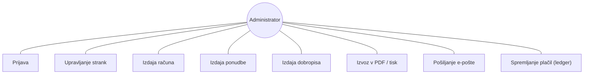
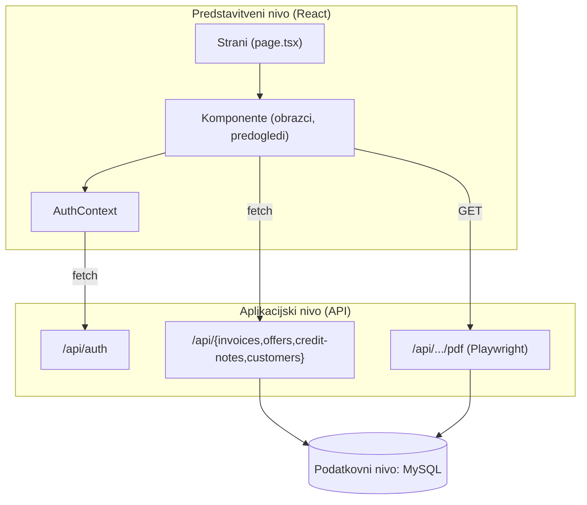

# Diplomsko poročilo

## Razvoj spletne aplikacije za izdajanje računov, ponudb in dobropisov ter vodenje strank

**Aplikacija: Računko (v4.5)**
**Naročnik / uporabnik: 2KM Consulting d.o.o.**
**Avtor: Anže Kos**

---

> Opomba: To je **predloga vsebine** diplomskega poročila, prilagojena dejanski aplikaciji. Besedilo lahko neposredno uporabiš ali prilagodiš zahtevam svoje fakultete (mentor, povzetek, ključne besede, citiranje virov, format strani). Razdelki so napisani tako, da odražajo dejansko stanje kode v repozitoriju.

---

## Povzetek

V okviru diplomskega dela je bila razvita spletna aplikacija **Računko**, namenjena vodenju strank ter izdajanju in upravljanju poslovnih dokumentov (računov, ponudb in dobropisov) za manjše svetovalno podjetje. Aplikacija omogoča celovit potek dela: od vnosa stranke, prek sestave dokumenta z avtomatskim izračunom DDV, do shranjevanja v podatkovno bazo, izvoza v PDF, pošiljanja po e-pošti in spremljanja plačil v t. i. bazi računov. Rešitev je zgrajena na ogrodju **Next.js** (React, TypeScript) s podatkovno bazo **MySQL** in vključuje avtentikacijo z žetoni JWT. Za generiranje PDF dokumentov sta uporabljena dva pristopa: strežniško tiskanje z orodjem Playwright in generiranje v brskalniku z jsPDF/html2canvas. Rezultat je delujoča aplikacija, ki je v praktični uporabi v podjetju in nadomešča ročno vodenje dokumentov v preglednicah.

**Ključne besede:** spletna aplikacija, Next.js, React, TypeScript, MySQL, izdajanje računov, DDV, PDF, JWT, upravljanje strank.

---

## Abstract

This thesis presents the development of a web application named **Računko**, designed for customer management and for issuing and managing business documents (invoices, offers and credit notes) for a small consulting company. The application supports the full workflow: entering a customer, composing a document with automatic VAT calculation, storing it in a database, exporting it to PDF, sending it by e-mail, and tracking payments in a dedicated ledger view. The solution is built on the **Next.js** framework (React, TypeScript) with a **MySQL** database and includes JWT-based authentication. PDF generation uses two approaches: server-side printing with Playwright and in-browser generation with jsPDF/html2canvas. The result is a working application, used in practice by the company, replacing manual document handling in spreadsheets.

**Keywords:** web application, Next.js, React, TypeScript, MySQL, invoicing, VAT, PDF, JWT, customer management.

---

## Kazalo (predlog)

1. Uvod
2. Opredelitev problema in cilji
3. Pregled tehnologij
4. Analiza zahtev
5. Načrtovanje rešitve (arhitektura in podatkovni model)
6. Implementacija
7. Testiranje in uvedba
8. Rezultati in ovrednotenje
9. Sklep in nadaljnje delo
10. Viri

---

## 1. Uvod

Mala in srednja podjetja pogosto izdajajo račune ročno – v urejevalnikih besedil ali preglednicah – kar je zamudno, dovzetno za napake (napačen DDV, podvojene številke) in oteži pregled nad plačili. Cilj diplomskega dela je bil razviti **enostavno, a celovito** spletno aplikacijo, ki ta postopek avtomatizira za konkretno svetovalno podjetje, ki strankam svetuje pri pridobivanju nepovratnih sredstev (subvencij iz javnih razpisov).

Aplikacija pokriva tri vrste dokumentov (računi, ponudbe, dobropisi), bogato bazo strank s finančnim sledenjem ter analitiko plačil. Razvita je kot sodobna spletna aplikacija, ki teče v brskalniku in podatke hrani v centralni bazi, dostopna pa je od koderkoli.

## 2. Opredelitev problema in cilji

**Problem:** ročno izdajanje dokumentov, razpršeni podatki o strankah in odsotnost pregleda nad plačili.

**Glavni cilji:**
- Centralna baza strank z naprednim iskanjem, filtri in finančnimi izračuni.
- Sestava računov, ponudb in dobropisov z avtomatskim izračunom DDV (22 %).
- Profesionalen izgled dokumentov z logotipom, podpisom in podatki podjetja.
- Izvoz v PDF in pošiljanje po e-pošti.
- Pregled plačil po mesecih in letih (plačano/neplačano).
- Varovan dostop (prijava).

**Nefunkcionalni cilji:** odzivnost, slovenski jezik in oblike (datumi, zneski), preprosta uporaba, vzdrževljiva koda.

## 3. Pregled tehnologij

- **Next.js 15 (App Router):** polnoskladovno ogrodje (frontend + strežniške poti v enem projektu); usmerjanje na podlagi map; strežniške funkcije (`route.ts`).
- **React 18 + TypeScript:** komponentni model UI in statična tipizacija za manj napak.
- **Tailwind CSS v4 + shadcn/ui (Radix UI):** hitra in dosledna stilizacija ter dostopne komponente.
- **MySQL + mysql2:** relacijska baza in gonilnik s podporo za »connection pool« in pripravljene poizvedbe.
- **JWT (jsonwebtoken) + bcryptjs:** seja brez stanja in varno shranjevanje gesla (hash).
- **Playwright (chromium):** strežniško pretvarjanje spletne strani v PDF z izbirljivim besedilom.
- **jsPDF + html2canvas:** alternativno generiranje PDF v brskalniku.
- **lucide-react, date-fns, recharts, sonner:** ikone, datumi, grafi, obvestila.

Utemeljitev izbire: Next.js združi odjemalca in strežnik, kar pohitri razvoj manjše ekipe; TypeScript zniža število napak; MySQL je razširjen in stabilen; JWT omogoča preprosto avtentikacijo brez seje na strežniku.

## 4. Analiza zahtev

**Funkcionalne zahteve (FZ):**
- FZ1: prijava administratorja.
- FZ2: CRUD nad strankami (ustvari, beri, posodobi, izbriši).
- FZ3: sestava in shranjevanje računa s postavkami in samodejnim DDV.
- FZ4: enako za ponudbe in dobropise.
- FZ5: pregled seznama dokumentov z iskanjem in filtriranjem.
- FZ6: spreminjanje statusa dokumenta (osnutek/poslan/plačan …).
- FZ7: izvoz dokumenta v PDF in tiskanje.
- FZ8: priprava e-pošte s podatki dokumenta.
- FZ9: evidenca plačil po mesecih/letih.
- FZ10: »Shrani kot nov« (kopiranje dokumenta).

**Nefunkcionalne zahteve (NFZ):**
- NFZ1: slovenski jezik in oblike.
- NFZ2: odzivnost vmesnika.
- NFZ3: varen dostop.
- NFZ4: zanesljivo shranjevanje (parametrizirane poizvedbe, preverjanje podvojenih številk).
- NFZ5: vzdrževljiva, modularna koda.

**Diagram primerov uporabe (use case):**



## 5. Načrtovanje rešitve

### 5.1 Arhitektura

Aplikacija sledi **tronivojski arhitekturi**, združeni v enem Next.js projektu:

1. **Predstavitveni nivo (frontend):** React strani in komponente v `app/` in `components/`.
2. **Aplikacijski nivo (backend):** strežniške poti v `app/api/**`, ki vsebujejo poslovno logiko in SQL.
3. **Podatkovni nivo:** MySQL baza, dostopana prek `lib/db-connection.ts`.



### 5.2 Podatkovni model

Osrednja tabela `Stranka` (podroben karton stranke s finančnim sledenjem subvencij), glave dokumentov (`Invoices`, `Offers`, `CreditNotes`) in postavke (`InvoiceItems`, `OfferItems`, `CreditNoteItems`). Razmerje je 1:N (stranka → dokumenti, dokument → postavke). Podroben opis in ER-diagram sta v tehnični dokumentaciji (`docs/01-dokumentacija-aplikacije.md`, pogl. 5).

### 5.3 Načrtovanje uporabniškega vmesnika

Konsistenten vmesnik z zložljivim stranskim menijem, vrhnjo vrstico, karticami in tabelami; obrazci so razdeljeni na zavihke; vsak dokument ima ločen obrazec in »predogled« (točen izgled končnega dokumenta).

## 6. Implementacija

### 6.1 Avtentikacija

Prijava prek `/api/auth/login` (preverjanje z `bcrypt.compare`, izdaja JWT z veljavnostjo 30 dni). Žeton se hrani v `localStorage`, ob vsaki menjavi strani pa se preveri prek `/api/auth/verify`. Stanje prijave vodi `AuthContext`, dostop do strani varuje `ProtectedRoute`.

### 6.2 Podatkovna plast in API

`lib/database.ts` ponuja tipizirane funkcije, ki kličejo API; vsaka API pot (`route.ts`) izvaja parametrizirane SQL poizvedbe. Branje seznamov je optimizirano z enim `JOIN`-om (izogib problemu N+1). Pri ustvarjanju se preverja podvojena številka dokumenta; pri urejanju se postavke »izbrišejo in znova vstavijo«.

Primer (vstavljanje računa, skrajšano):
```ts
const result = await query(
  `INSERT INTO Invoices (invoice_number, customer_id, ..., status)
   VALUES (?, ?, ..., 'draft')`, [...])
const invoiceId = result.insertId
for (const item of invoice.items)
  await query(`INSERT INTO InvoiceItems (...) VALUES (?, ?, ?, ?, ?)`, [invoiceId, ...])
```

### 6.3 Izračun DDV

Na strani obrazca: `totalWithoutVat = Σ(quantity × price)`, `vat = totalWithoutVat × 0.22`, `totalPayable = totalWithoutVat + vat`. Decimalni vnos podpira tako vejico kot piko (`parseLocaleNumber`).

### 6.4 Generiranje PDF

Prednostno strežniško (Playwright »natisne« stran `/print/[id]` v A4 PDF z izbirljivim besedilom), z rezervo v brskalniku (html2canvas izriše predogled v sliko visoke ločljivosti, jsPDF jo zloži v PDF; noga se doda vektorsko). Posebna pozornost je bila namenjena pretvorbi sodobnih barv `oklch()` v `hex`, ki jih html2canvas ne podpira.

### 6.5 Evidenca plačil (ledger)

Stran `invoices/ledger` prikaže račune po mesecih/letih z urejanjem na mestu (plačani znesek in opombe), sproti izračuna neplačani del in vsote ter barvno označi stanje. Shranjevanje gre prek `/api/invoices/:id/payment`.

### 6.6 Moduli ponudb in dobropisov

Zgrajeni so po vzoru računov, z razlikami v statusih (ponudbe: sprejeta/zavrnjena), privzeti valuti (ponudbe +30 dni) in besedilu dokumentov (dobropis govori o »vračilu«).

## 7. Testiranje in uvedba

- **Ročno funkcionalno testiranje** vseh tokov (prijava, CRUD, PDF, e-pošta, ledger).
- **Diagnostika baze** prek `/api/test-db`.
- **Robustnost vnosa:** preverjanje obveznih polj, podvojenih številk, razčlenjevanje decimalk.
- **Uvedba:** okolje je nastavljeno z okoljskimi spremenljivkami (`DB_*`, `ADMIN_*`, `JWT_SECRET`); aplikacija je primerna za gostovanje na platformah kot Vercel (koda zazna serverless okolje in prilagodi velikost pool-a).

## 8. Rezultati in ovrednotenje

Razvita aplikacija izpolnjuje vse zastavljene funkcionalne cilje (FZ1–FZ10). V praksi skrajša čas izdaje dokumenta, prepreči podvojene številke in zagotovi enoten, profesionalen izgled. Evidenca plačil daje hiter pregled nad terjatvami. Glede na izhodišče (ročno delo v preglednicah) je rešitev znatna izboljšava.

**Omejitve:** avtentikacija je preverjena le na strani odjemalca (API ni zaščiten s strežniško strážo), e-pošta se ne pošilja samodejno (le `mailto:`), v repozitoriju manjkajo SQL skripte za tabele dokumentov. Te točke so podrobneje obravnavane v tehnični dokumentaciji (pogl. 19) in predstavljajo izhodišče za nadgradnjo.

## 9. Sklep in nadaljnje delo

Diplomsko delo je doseglo cilj: razvita je delujoča, v praksi uporabljena aplikacija za izdajanje dokumentov in vodenje strank. Nadaljnje delo: (1) strežniška zaščita API poti (middleware/JWT), (2) pravo pošiljanje e-pošte s priponko (SMTP/Resend), (3) avtomatsko številčenje in pretvorba ponudbe v račun, (4) izvoz e-računov (e-SLOG), (5) nadzorna plošča z grafi, (6) prehod na decimalno aritmetiko za zneske, (7) podpora več uporabnikom in vlogam.

## 10. Viri (predlog)

- Next.js – uradna dokumentacija: https://nextjs.org/docs
- React – uradna dokumentacija: https://react.dev
- MySQL – referenčni priročnik: https://dev.mysql.com/doc/
- mysql2 (npm): https://github.com/sidorares/node-mysql2
- JSON Web Tokens (RFC 7519): https://datatracker.ietf.org/doc/html/rfc7519
- bcrypt – opis algoritma: https://en.wikipedia.org/wiki/Bcrypt
- Playwright – dokumentacija: https://playwright.dev
- jsPDF: https://github.com/parallax/jsPDF · html2canvas: https://html2canvas.hertzen.com
- Tailwind CSS: https://tailwindcss.com · shadcn/ui: https://ui.shadcn.com · Radix UI: https://www.radix-ui.com
- Zakon o davku na dodano vrednost (ZDDV-1), splošna stopnja DDV v RS.

---

*Za podroben tehnični opis vsake komponente glej `docs/01-dokumentacija-aplikacije.md`. Za pripravo na zagovor glej `docs/03-vprasanja-za-zagovor.md`.*
